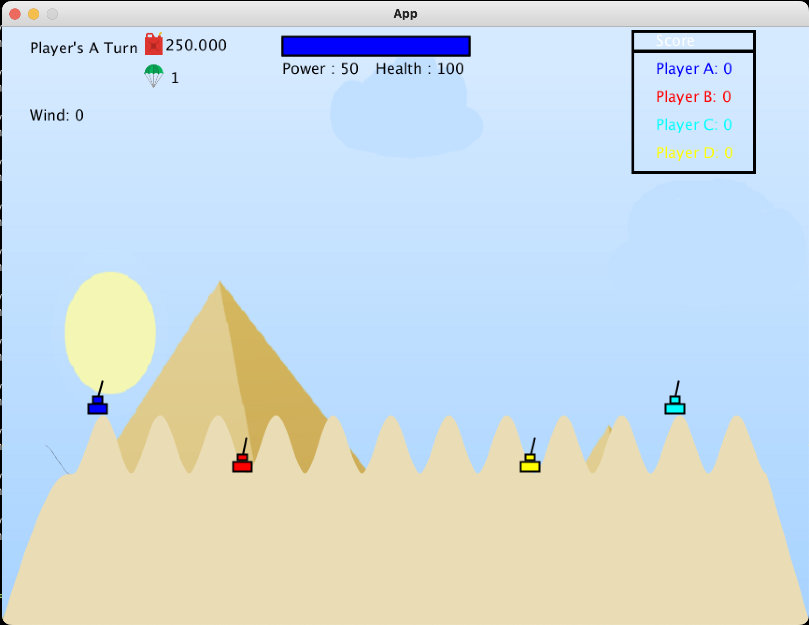
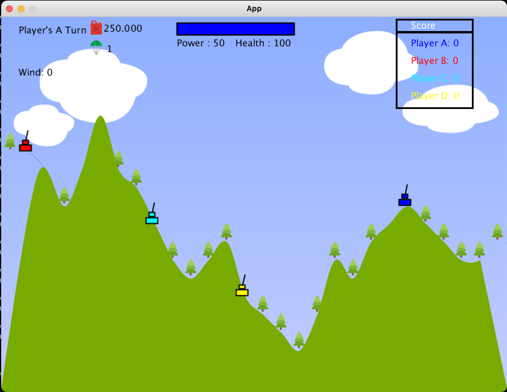
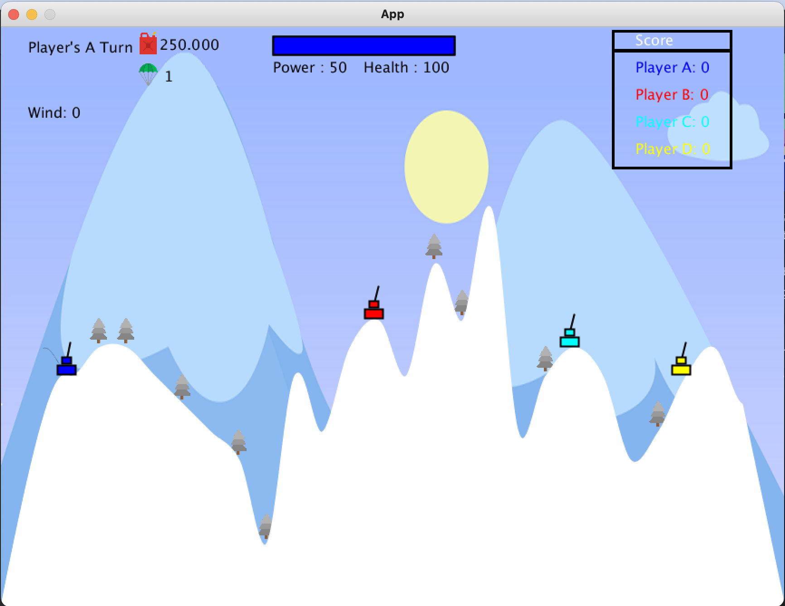

# Prerequisites

Before you can run this project, make sure you have the following installed:

1. **Java 8**
   - Ensure that you have Java 8 installed on your machine. You can check your Java version by running the following command in your terminal:

     ```bash
     java -version
     ```

   - If Java 8 is not installed, you can download it from the [Oracle website](https://www.oracle.com/java/technologies/javase/javase8-archive-downloads.html) or use a package manager.

2. **Gradle**
   - You need to have Gradle installed to build and run the project. You can check if Gradle is installed by running:

     ```bash
     gradle -v
     ```

   - If Gradle is not installed, you can follow the instructions on the [Gradle installation page](https://gradle.org/install/).

3. **Running the Project**
   - After ensuring that both Java and Gradle are installed, navigate to the project directory in your terminal and run the following command to execute the project:

     ```bash
     gradle run
     ```

By following these steps, you should be able to set up your environment to run the project successfully.


## Images


